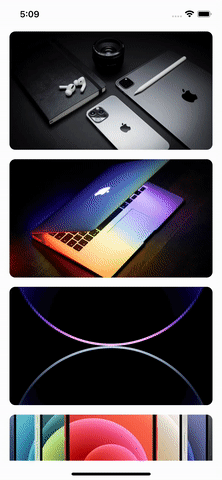
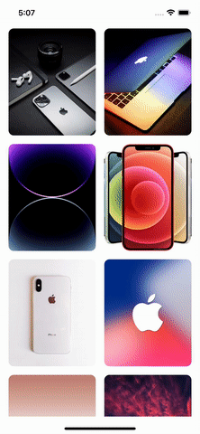
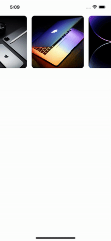

# react-native-photos-gallery

## [](https://www.npmjs.org/package/react-native-country-code-select) [](https://www.android.com) [](https://developer.apple.com/ios) [](https://opensource.org/licenses/MIT)


Introducing a cutting-edge Photo Gallery library built with pure JavaScript and React Native Reanimated, designed to enhance your photo gallery experience by allowing you to effortlessly open and view selected photos.

Our user-friendly and highly customizable library ensures a seamless experience. Whether you're an Android or iOS user, our library is compatible with both platforms, guaranteeing optimal performance.


## 🎬 Preview

| OneColumn List                             | TwoColumn List                           | Horizontal List                           |
| ------------------------------------------ | ---------------------------------------- | ----------------------------------------- |
|  |  |  |


## Quick Access

- [Installation](#installation)
- [Usage and Examples](#usage)
- [Properties](#properties)
- [Example Code](#example)
- [License](#license)

## Getting Started 🔧
Here's how to get started with react-native-photos-gallery in your React Native project:

### Installation
##### 1. Install the package:

Using `npm`:

```sh
npm install react-native-photos-gallery react-native-reanimated react-native-gesture-handler
```

Using `Yarn`:

```sh
yarn add react-native-photos-gallery react-native-reanimated react-native-gesture-handler
```

##### 2. Install cocoapods in the ios project

```bash
cd ios && pod install
```

> Note: Make sure to add Reanimated's babel plugin to your `babel.config.js`

```js
module.exports = {
      ...
      plugins: [
          ...
          'react-native-reanimated/plugin',
      ],
  };
```

##### Know more about [react-native-reanimated](https://www.npmjs.com/package/react-native-reanimated)


## Usage

#### Sample Data

```jsx
const data = [
  {
    id: number,
    source: ImageSourcePropType,
  },
];
```

#### Basic Example 

```jsx
import React from 'react';
import { SafeAreaView, StyleSheet } from 'react-native';
import { PhotoGallery } from 'react-native-photos-gallery';

export const data = [
  {
    id: 1,
    source: require('./assets/images/apple.jpeg'),
  },
  {
    id: 2,
    source: require('./assets/images/apple_icon.jpeg'),
  },
  {
    id: 3,
    source: require('./assets/images/DeepPurple.png'),
  },
  {
    id: 4,
    source: require('./assets/images/iPhone12.jpeg'),
  },
  {
    id: 5,
    source: require('./assets/images/iPhoneX.jpeg'),
  },
  {
    id: 6,
    source: require('./assets/images/iphoneXWall.jpg'),
  },
  {
    id: 7,
    source: require('./assets/images/112ProMax.jpg'),
  },
  {
    id: 8,
    source: {
      uri: 'https://cdn.pixabay.com/photo/2015/04/23/22/00/tree-736885__480.jpg',
    },
  },
];

const App = () => {
  return (
    <SafeAreaView style={styles.screen}>
      <PhotoGallery
        data={data}
        onImageExpand={({ visible }) => console.log(visible)}
        animatedImageDelay={60}
        modalBackgroundStyle={styles.modalBackgroundStyle}
      />
    </SafeAreaView>
  );
};

export default App;

const styles = StyleSheet.create({
  screen: { flex: 1 },
  modalBackgroundStyle: {
    backgroundColor: 'white',
  },
});
```

#### 🎬 Preview

## 

## Properties

| Props                        |  Default  |                  Type                   | Description                                                                                            |
| ---------------------------- | :-------: | :-------------------------------------: | ------------------------------------------------------------------------------------------------------ |
| **data**                     |     -     |         [Data](#sample-data)         | Data to render images                                                                                  |
| scaledImageResizeMode        | `'cover'` |            `ImageResizeMode`            | Image size mode                                                                                        |
| animationCloseSpeed          |    350    |            `Range<200, 500>`            | Animation close speed between 200 to 500                                                               |
| animatedThumbnailScrollSpeed |    30     |             10 \| 20 \| 30              | Thumbnail List scroll speed                                                                            |
| animatedImageDelay           |    90     |          20 \| 30 \| 60 \| 90           | Animated image delay                                                                                   |
| thumbnailListImageHeight     |    120    |                 number                  | Height of thumbnail list image                                                                         |
| thumbnailListImageWidth      |    120    |                 number                  | Width of thumbnail list image                                                                          |
| thumbnailListImageSpace      |    10     |                 number                  | Space between thumbnail list images                                                                    |
| renderHeader                 |     -     |                function                 | Custom header content instead of default child content and it provide `close()` as an argument                           |
| onImageExpand                |     -     |                function                 | Function to call when image expanded and it provide `{visible}` as an argument                |
| renderNetworkLoader          |     -     |                function                 | Custom network loader instead of default loader                                                      |
| flatListProps                |     -     | FlatListProps<[ArrayData](#arraydata)>  | Provide <a href="https://reactnative.dev/docs/flatlist#props">flatlist props</a>                       |
| listItemProps                |     -     |     [ListItemProps](#listitemprops)     | List item props contain `containerStyle`, `imageContainerStyle` and `imageProps`                       |
| modalProps                   |     -     |               ModalProps                | Provide <a href="https://reactnative.dev/docs/modal#props">Modal props</a>                             |
| modalBackgroundProps         |     -     |        `AnimateProps<ViewProps>`        | Provide animated view props                                                                            |
| modalBackgroundStyle         |     -     |        `AnimateStyle<ViewStyle>`        | Modal background style                                                                                 |
| modalHeaderProps             |     -     |  [ModalHeaderProps](#modalheaderprops)  | Modal header props contain `containerProps` and `containerStyle`                                       |
| modalContentProps            |     -     | [ModalContentProps](#modalcontentprops) | Modal content props contain `contentProps` and `contentStyle`                                          |
| modalContentImageProps       |     -     |       `AnimateProps<ImageProps>`        | Modal content <a href="https://reactnative.dev/docs/image#props">Image props</a>                       |
| modalFooterProps             |     -     |  [ModalFooterProps](#modalfooterprops)  | Modal footer props contain `thumbnailFlatListProps`, `footerContainerProps` and `footerContainerStyle` |
| networkLoaderProps           |     -     |        `ActivityIndicatorProps`         | Provide <a href="https://reactnative.dev/docs/activityindicator#props">ActivityIndicator props</a>     |
| networkImageProps            |     -     |              `ImageProps`               | Provide <a href="https://reactnative.dev/docs/image#props">Image props</a>                             |

---

##### ListItemProps

| Props               | Default |            Type            | Description           |
| ------------------- | :-----: | :------------------------: | --------------------- |
| containerStyle      |    -    |         ViewStyle          | Container style       |
| imageContainerStyle |    -    | `AnimateStyle<ViewStyle>`  | Image container style |
| imageProps          |    -    | `AnimateProps<ImageProps>` | Image Props           |

---

##### ModalHeaderProps

| Props          | Default |           Type            | Description     |
| -------------- | :-----: | :-----------------------: | --------------- |
| containerProps |    -    | `AnimateProps<ViewProps>` | Container props |
| containerStyle |    -    | `AnimateStyle<ViewStyle>` | Container style |

---

##### ModalContentProps

| Props        | Default |           Type            | Description   |
| ------------ | :-----: | :-----------------------: | ------------- |
| contentProps |    -    | `AnimateProps<ViewProps>` | Content props |
| contentStyle |    -    | `AnimateStyle<ViewStyle>` | Content style |

---

##### ModalFooterProps

| Props                  | Default |           Type            | Description               |
| ---------------------- | :-----: | :-----------------------: | ------------------------- |
| thumbnailFlatListProps |    -    |   `FlatListProps<any>`    | Thumbnail flatlist props |
| footerContainerProps   |    -    | `AnimateProps<ViewProps>` | Container props           |
| footerContainerStyle   |    -    | `AnimateStyle<ViewStyle>` | Container style           |

##### Know more about [ViewProps](https://reactnative.dev/docs/view#props), [ViewStyle](https://reactnative.dev/docs/view-style-props), [FlatListProps](https://reactnative.dev/docs/flatlist#props), [ModalProps](https://reactnative.dev/docs/modal#props), [ImageProps](https://reactnative.dev/docs/image#props)

# Example

A full working example project is here [Example](./example/src/App.tsx)

```sh
yarn
yarn example ios   // For ios
yarn example android   // For Android
```

## Find this library useful? ❤️

Support it by joining [stargazers](https://github.com/SimformSolutionsPvtLtd/react-native-photos-gallery/stargazers) for this repository.⭐

## Bugs / Feature requests / Feedbacks

For bugs, feature requests, and discussion please use [GitHub Issues](https://github.com/SimformSolutionsPvtLtd/react-native-photos-gallery/issues/new?labels=bug&late=BUG_REPORT.md&title=%5BBUG%5D%3A), [GitHub New Feature](https://github.com/SimformSolutionsPvtLtd/react-native-photos-gallery/issues/new?labels=enhancement&late=FEATURE_REQUEST.md&title=%5BFEATURE%5D%3A), [GitHub Feedback](https://github.com/SimformSolutionsPvtLtd/react-native-photos-gallery/issues/new?labels=enhancement&late=FEATURE_REQUEST.md&title=%5BFEEDBACK%5D%3A)

## 🤝 How to Contribute

We'd love to have you improve this library or fix a problem 💪
Check out our [Contributing Guide](CONTRIBUTING.md) for ideas on contributing.

## Awesome Mobile Libraries

- Check out our other [available awesome mobile libraries](https://github.com/SimformSolutionsPvtLtd/Awesome-Mobile-Libraries)

## License

- [MIT License](./LICENSE)
